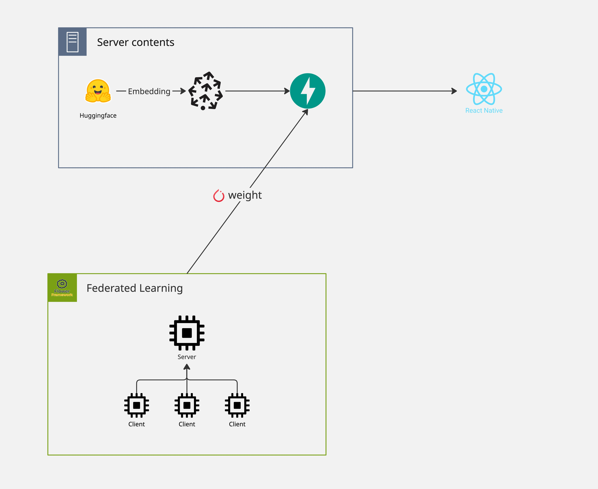
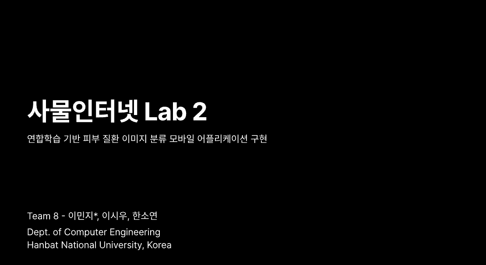

# [Team 8] 사물인터넷 Lab-02 연합학습 논문 구현 

## 목차
- [1. 프로젝트 소개](#1-프로젝트-소개)
  - [a. 레포지토리 설명](#a-레포지토리-설명)
  - [b. 프로젝트 설명](#b-프로젝트-설명)
- [2. 팀원 소개](#2-팀원-소개)
- [3. 기술 스택](#3-기술스택)
- [4. 시스템 아키텍처](#4-시스템-아키텍쳐)
- [5. 데이터셋 구성 및 통계](#5-데이터셋-구성-및-통계)
  - [a. 전체 데이터 분포](#a-전체-데이터-분포)
  - [b. Central Learning (중앙 모델 사전 학습) 데이터 구성](#b-central-learning-중앙-모델-사전-학습-데이터-구성)
  - [c. Federated Learning 데이터 구성](#c-federated-learning-데이터-구성)
  - [d. 클라이언트(사용자)별 데이터 분배](#d-클라이언트사용자별-데이터-분배)
- [6. 애플리케이션 구동법](#5-애플리케이션-구동법)
  - [a. 백엔드 구동](#a-백엔드-구동)
  - [b. 프론트엔드 구동](#b-프론트엔드-구동)
- [7. 추가 자료](#6-추가-자료)
- [8. 참고 자료](#7-참고-자료)


## 1. 프로젝트 소개
### a. 레포지토리 설명
|Name|Description|Link|
|:-:|:-:|:-:|
|federated-iot-project|중앙 모델 도메인 학습용 코드|[federated-iot-project](https://github.com/IoTFedLab/federated-iot-project)|
|flower-server|연합학습용 flower 관련 코드|[flower-server](https://github.com/IoTFedLab/flower-server)|
|fed-app|애플리케이션 코드(프론트엔드)|[fed-app](https://github.com/IoTFedLab/fed-app)|
|fed-api|모델 로드 및 db 연결용 api 서버(백엔드)|[fed-api](https://github.com/IoTFedLab/fed-api)|
<!--여기에 설명 추후 적어야함...-->

### b. 프로젝트 설명
#### 1) 배경
본 프로젝트는 **연합학습(Federated Learning)을 기반으로 한 피부 질환 이미지 분류 모바일 애플리케이션**을 구현하는 것을 목표로 한다. 피부 질환 이미지는 얼굴 및 신체 부위가 직접 노출되는 민감 의료 정보에 해당하여, 기존의 중앙집중식 데이터 수집·학습 방식에는 법적·윤리적 제약이 존재한다. 이로 인해 대규모 데이터 확보가 어렵고, 실제 사용자 환경을 반영한 모델 학습에 한계가 존재한다.<br/>
또한 피부 질환의 정확한 진단을 위해서는 병원 방문이 필수적인 경우가 많아, 시간·비용·거리로 인한 의료 접근성 문제 역시 지속적으로 제기되어 왔다. 이러한 배경에서 본 프로젝트는 개인정보를 보호하면서도 사용자 접근성을 개선할 수 있는 새로운 학습·서비스 구조를 제안한다.

#### 2) 수행 방식
본 프로젝트는 사용자 기기에서 직접 데이터를 학습하고, 원본 이미지를 서버로 전송하지 않는 **연합학습** 구조를 채택하였다.
각 클라이언트는 로컬 데이터로 모델을 학습한 뒤, **모델 가중치만 중앙 서버로 전달**하며, 서버는 이를 집계하여 글로벌 모델을 업데이트한다. 이 과정에서 Federated Averaging(FedAvg) 및 FedProx 알고리즘을 적용하여, 클라이언트 간 데이터 분포 차이(Non-IID 문제)를 완화하고 학습 안정성을 확보하였다.

#### 3) 기술적 특징
- **피부질환 도메인 특화 중앙모델 파인튜닝**<br/>
기존 ImageNet으로 사전 학습된 모델은 피부 질환 이미지 분류에서 29%의 정확도를 보여, 해당 도메인에 적합하지 않은 것으로 판단하였다. 이에 따라, 전체 데이터셋의 70%를 중앙 모델 fine-tuning용으로 사용하여, 모델을 피부질환 도메인에 특화시켰다. 그 결과, 기존 29%에서 86%로 피부질환 이미지 분류에 대한 성능을 비약적으로 향상시켰다.

- **Pytorch 기반 학습 환경**<br/>
기존 TensorFlow/TFLite 중심 연구의 구조적 한계를 극복하기 위해, 확장성과 실험 효율이 높은 PyTorch 기반으로 전체 학습 파이프라인을 재구성하였다.

- **멀티모달 보완 구조**<br/>
이미지 분류 정확도의 한계를 보완하기 위해, 증상 설명 텍스트를 임베딩하여 이미지–텍스트 간 의미 유사도 기반 보조 판단 구조를 도입한다.

## 2. 팀원 소개

<div align="center">
  
|이민지|한소연|이시우|
|:-:|:-:|:-:|
||||
|[@Minter-v1](https://github.com/Minter-v1)<br/><ul align="center"><li>프로젝트 총괄</li><li>학습 인프라 설계 및 구현</li></ul>|[@Soyeon Han](https://github.com/Han-soyeon)<br/><ul><li>애플리케이션 디자인</li><li>애플리케이션 구현</li></ul>|[@ceeeu](https://github.com/ceeeu)<br/><ul align="center"><li>api 서버 설계</li><li>데이터베이스 관련 작업</li></ul>|

</div>

## 3. 기술스택

<!-- 플라워 로고 -->
<!-- 역할별로 로고 분리하면 좋을 듯 -->

## 4. 시스템 아키텍쳐


## 5. 데이터셋 구성 및 통계
본 프로젝트는 AI-Hub 안면부 피부질환 이미지 데이터셋을 기반으로 하였으며,  
정면 및 측면 이미지를 모두 포함한 6개 피부 질환 클래스로 구성된다.

---

### a. 전체 데이터 분포

| 질병명 | 측면 | 정면 | Total |
|---|---:|---:|---:|
| 정상 | 800 | 800 | 1600 |
| 여드름 | 800 | 800 | 1600 |
| 주사 | 800 | 800 | 1600 |
| 아토피 | 800 | 800 | 1600 |
| 건선 | 800 | 800 | 1600 |
| 지루 | 800 | 800 | 1600 |
| 총합 |  |  |       9600 |

> 모든 클래스는 동일한 수의 정면/측면 이미지를 포함하여  
> 클래스 및 시점(Viewpoint) 불균형을 최소화하였다.

---

### b. Central Learning (중앙 모델 사전 학습) 데이터 구성

중앙 모델은 전체 데이터셋의 약 70% (6,720장) 를 사용하여  
피부질환 도메인에 특화된 fine-tuning을 수행하였다.

| 질병 구분 | 수량 |
|---|---:|
| 건선_정면 | 560 |
| 건선_측면 | 560 |
| 주사_정면 | 560 |
| 주사_측면 | 560 |
| 지루_정면 | 560 |
| 지루_측면 | 560 |
| 정상_정면 | 560 |
| 정상_측면 | 560 |
| 여드름_정면 | 560 |
| 여드름_측면 | 560 |
| 아토피_정면 | 560 |
| 아토피_측면 | 560 |
| 총합 | 6720 |

---

### c. Federated Learning 데이터 구성

연합학습 단계에서는 중앙 학습에 사용되지 않은  
전체 데이터의 30% (2,880장) 를 사용하였다.

| 질병 구분 | 수량 |
|---|---:|
| 건선_정면 | 240 |
| 건선_측면 | 240 |
| 주사_정면 | 240 |
| 주사_측면 | 240 |
| 지루_정면 | 240 |
| 지루_측면 | 240 |
| 정상_정면 | 240 |
| 정상_측면 | 240 |
| 여드름_정면 | 240 |
| 여드름_측면 | 240 |
| 아토피_정면 | 240 |
| 아토피_측면 | 240 |
| 총합 | 2880 |

---

### d. 클라이언트(사용자)별 데이터 분배

연합학습 환경을 가정하여, 각 클라이언트는  
동일한 수의 데이터를 보유하도록 균등 분배하였다.

| 질병 구분 | 민지 | 시우 | 소연 |
|---|---:|---:|---:|
| 건선_정면 | 80 | 80 | 80 |
| 건선_측면 | 80 | 80 | 80 |
| 주사_정면 | 80 | 80 | 80 |
| 주사_측면 | 80 | 80 | 80 |
| 지루_정면 | 80 | 80 | 80 |
| 지루_측면 | 80 | 80 | 80 |
| 정상_정면 | 80 | 80 | 80 |
| 정상_측면 | 80 | 80 | 80 |
| 여드름_정면 | 80 | 80 | 80 |
| 여드름_측면 | 80 | 80 | 80 |
| 아토피_정면 | 80 | 80 | 80 |
| 아토피_측면 | 80 | 80 | 80 |
| 총합 | 960 | 960 | 960 |

> 클라이언트 간 데이터 수를 균등하게 분배하여  
> 데이터 수 차이에 따른 학습 편향을 제거하였다.


## 6. 애플리케이션 구동법
> Expo를 모바일에 선행적으로 설치합니다. 배포된 서버가 아닌 **로컬 서버 구동**을 원칙으로 합니다.
### a. 백엔드 구동
#### 1) 환경변수 등록
> 벡터 DB는 외부에 공개되지 않습니다.
실제 멀티모달 서비스 테스트가 필요한 경우, 별도 요청 시 API를 발급해 드립니다.
```bash
PINECONE_API_KEY="YOUR_KEY"
PINECONE_ENVIRONMENT="YOUR_LOCATION"
PINECONE_INDEX_NAME="YOUT_INDEX_NAME"
IMAGE_MODEL_PATH=models/best_model.pt
DISEASE_CLASSES=["건선", "아토피", "여드름", "정상", "주사", "지루"]
```
#### 2) 실행
> http://127.0.0.1/8000/docs 혹은 http://localhost:8000/docs 로 swagger 문서 확인 가능합니다.(단일 엔드포인트: model)
```bash
# 의존성 설치
pip install -r requirements.txt

# 루트에서 실행
uvicron app.main:app --reload
```
### b. 프론트엔드 구동

#### 1) 환경변수 등록
```bash
EXPO_PUBLIC_BASE_URL="http://YOUR_IP:8000"
```
#### 2) 실행
```bash
# 의존성 설치
npm install

# 디렉터리 이동
cd fed-app

# 애플리케이션 실행 후 플랫폼 선택
npm start or expo go

# 각 플랫폼 별로 실행
npm ios
npm android
npm web
```

## 7. 추가 자료(발표 자료)
<!--발표 자료랑 실제 애플리케이션 캡쳐본 넣으면 좋을 것 같음-->
> [발표자료 바로가기](./docs_asset/[사물인터넷-오후반]_팀8_프로젝트2_발표자료.pdf)
</br>


## 8. 참고 자료
<!-- 원본 논문 링크 -->
[송현진, 문현수, 이영석.
「연합학습 기반 피부 질환 이미지 분류 모바일 어플리케이션」,
한국소프트웨어종합학술대회 논문집, 2021, pp. 1220–1222.](https://www.dbpia.co.kr/journal/articleDetail?nodeId=NODE11035999)
<!-- 허깅페이스 링크 -->
[사용한 pytorch로 포팅된 mobilenet_v3](https://huggingface.co/timm/mobilenetv3_small_100.lamb_in1k)
<!-- 고려대 모델 링크 -->
[한국어 특화 임베딩 모델(KURE)](https://huggingface.co/nlpai-lab/KURE-v1)
<!-- 데이터셋 링크 -->
[ai-hub 안면부 피부질환 데이터셋](https://www.aihub.or.kr/aihubdata/data/view.do?currMenu=115&topMenu=100&aihubDataSe=data&dataSetSn=71863)
